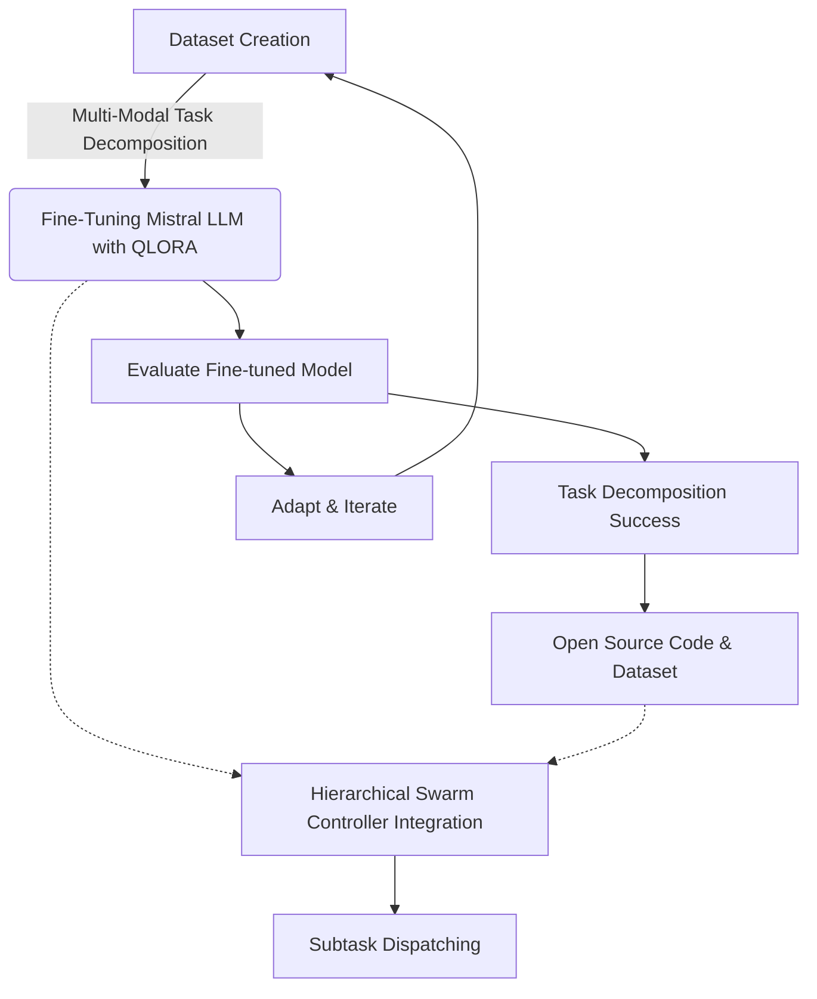

# Decompose and Conquer: Introducing the First Open Source Large Language Model with Multi-Modal Task Decomposition Capabilities


## Abstract

This repository introduces the first open-source Large Language Model (LLM) fine-tuned for task decomposition, utilizing the 7-billion-parameter Mistral LLM. Our model bridges a critical gap in designing controller agents for hierarchical swarm networks by efficiently decomposing composite tasks into actionable subtasks. This capability is underpinned by a specially curated multi-modal dataset following the alpaca format, designed for the decomposition of composite tasks into text, image, video, and audio subtasks, as well as combinations thereof. Leveraging Quantized Low Rank Adapters (QLORA) for fine-tuning, we push the boundaries of task-specific LLM adaptability and performance. The repository encompasses the training source code, adapters, the original dataset, and comprehensive evaluation results—marking significant strides in task decomposition and multi-modal AI research.

## Main Contributions

1. **First Open Source LLM for Task Decomposition**: We present the pioneering effort of finely tuning an LLM specifically aimed at decomposing composite tasks into manageable subtasks.
2. **Dataset for Multi-Modal Task Decomposition**: Creation of an original dataset, designed to facilitate the analysis and generation of multi-modal composite tasks, setting a new benchmark for task decomposition studies.
3. **Design of Multi-Modal Dataset for Composite Task Decomposition**: Our dataset is a testament to innovation in AI training materials, supporting a wide variety of complexity in multi-modal scenarios, including single-mode tasks.

## Repository Contents

- **Dataset**: The custom-created dataset in alpaca format for multi-modal task decomposition.
- **Fine-Tuning Source Code**: Complete source code used for fine-tuning the Mistral LLM, featuring advanced techniques such as QLORA.
- **Adapters and Tools**: All adapters and tools developed and utilized during the fine-tuning process.
- **Evaluation Results**: Detailed results from the evaluation of the fine-tuned model on various task decomposition benchmarks.
- **License**: Open-source license detailing how the resources can be used.

## Workflow Diagram and Explanation



This diagram illustrates our iterative process, beginning with **Dataset Creation** specifically engineered for multi-modal task decomposition challenges. The dataset then drives the **Fine-Tuning** of the Mistral LLM utilizing **QLORA**, paving the way for comprehensive **Evaluation**. Upon successful evaluation, identified as **Task Decomposition Success**, the process leads to the release of our **Open Source Code & Dataset**. Parallelly, the fine-tuned model facilitates **Hierarchical Swarm Controller Integration**, crucial for **Subtask Dispatching** among agent networks. The cyclic arrow from **Adapt & Iterate** back to **Dataset Creation** signifies our commitment to continual improvement and adaptation of our tools and datasets based on evaluation feedback, ensuring that our resources remain at the vanguard of AI research and application.

## How to Use

### Installation

Install all the necessary requirements.

```sh
pip install -r requirements.txt
```

### Environment Variables

Create a .env file and set your ```openai``` API key and other required API keys of your choice, e.g., wandb and huggingface.

### Dataset Generation

To create the dataset from scratch use the script provided in the `dataset` directory under `create_dataset.py`. We have already provided the 1k rows of the dataset for you to use in the `data` directory stored as 50 json files each of which containing 20 rows of the dataset.

### Fine-Tuning

To run the fine-tuning, save the fine-tuned model and tokenizer, and the evaluation results use the following command.

```sh
python main.py
```

## Checkpoints

The final adapter checkpoints, tokenizer, and additional files are provided in the `final_checkpoint` directory.

## Results

The evaluation results for decomposing multi-modal composite tasks are stored in the `results` directory. Other metrics including training and evaluation losses are provided in the `assets` directory.

## Author

Arash Shahmansoori (arash.mansoori65@gmail.com)

## License

This project is open-sourced under the [MIT License](LICENSE), allowing for widespread use and contribution back to the community. Please refer to the [MIT License](LICENSE) file for detailed terms and conditions.

## Acknowledgements

We extend our gratitude to the AI research community for the open-source tools and datasets that have made this work possible. Special thanks to the contributors of the Mistral LLM and the creators of the QLORA technique for their groundbreaking contributions to the field of AI.

---

We invite contributors, researchers, and AI enthusiasts to join us in advancing the field of task decomposition and multi-modal AI research. Together, we can build powerful AI systems capable of understanding and executing complex composite tasks.