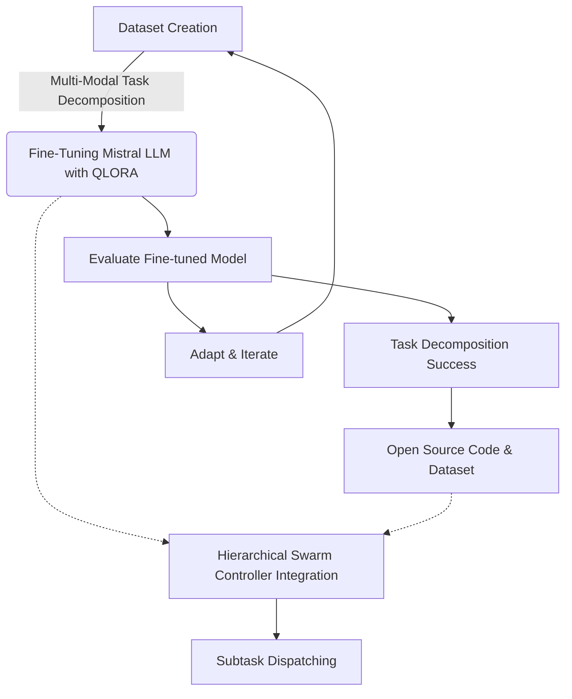
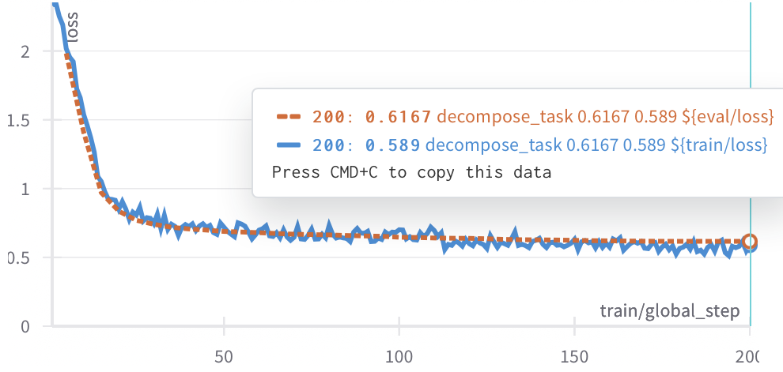

# Decompose and Conquer: Introducing the First Open Source Large Language Model with Multi-Modal Task Decomposition Capabilities


## Introduction
In the landscape of artificial (general) intelligence and machine learning, the breakdown of composite tasks into actionable subtasks stands as a cornerstone for enhancing efficiency and effectiveness within hierarchical swarm networks of agents. This blog post introduces a pioneering step in this domain through the development and open-sourcing of a fine-tuned Large Language Model (LLM) named Mistral, based on a custom dataset specifically designed for task decomposition. Our model is uniquely positioned as the first open-source LLM tailored for the decomposition of composite tasks into subtasks, a capability crucial for the orchestration roles played by controller agents in hierarchical swarm networks.

Our contributions are threefold and mark significant advancements in the field:

1. **Introduction of the First Open Source LLM for Multi-Modal Task Decomposition**: Mistral, equipped with 7 billion parameters, has been meticulously fine-tuned to not only understand but also decompose multi-modal tasks (encompassing text, image, video, and audio) into actionable subtasks. This fine-tuning employs advanced technologies, including Quantized Low Rank Adapters (QLORA), enabling Mistral to act as a controller agent orchestrating tasks among a network of agents. This capability is pivotal for enhancing the autonomy and efficiency of such networks, especially in hierarchical swarm agent setups.

2. **Design of a Multi-Modal Dataset for Composite Task Decomposition**: The tailored dataset stands as the bedrock of this initiative. Crafted in the alpaca dataset format for LLMs, it spans across multi-modal scenarios, embracing a wide variety of composite tasks combining text, image, video, and audio. The dataset's design focuses on the generation and analysis of these composite tasks, offering a novel resource for the community to engage with and build upon.

3. **Open Sourcing of Training Source Code, Adapters, and Evaluation Results**: In alignment with the spirit of collaboration and transparency that propels our field forward, all elements involved in the fine-tuning process, including source code, adapter checkpoints, and meticulous evaluation results, have been made openly available. This gesture not only invites scrutiny and further refinement from the community but also lowers the barriers for researchers and practitioners wishing to delve into task decomposition and LLM fine-tuning.

By integrating these contributions, this work not only paves the way for a new breed of LLM capable of dissecting and understanding the nuances of composite tasks but also significantly impacts the design and operation of controller agents within hierarchical swarm networks. Through open-source channels, we aspire to foster innovation, collaboration, and further research in this promising domain, ultimately leading to more intelligent, autonomous, and efficient multi-agent systems.

## Proposed Method
The proposed method for enhancing task decomposition in a hierarchical swarm network of agents using a fine-tuned open-source large language model (LLM) focuses on the innovative integration of a custom dataset, advanced fine-tuning techniques, and the deployment of the fine-tuned model for orchestrating complex composite tasks. This method is encapsulated in three main contributions: the development of the first open-source LLM for multi-modal task decomposition; the creation of a multi-modal dataset specifically designed for composite task decomposition; and the open sourcing of the entire codebase, including Quantized Low Rank Adapters (QLORA) for fine-tuning, dataset, and evaluation results.

The workflow of the proposed method is visualized through a Mermaid markdown diagram, offering a clear, step-by-step process from dataset creation to the integration of the fine-tuned model into hierarchical swarm networks for orchestrating task decomposition.



The proposed method described through the block diagram unfolds as follows:

1. **Dataset Creation**: We embark on our journey with the crafting of a unique dataset specifically tailored for task decomposition. This dataset, adhering to the Alpaca format, encompasses a wide array of multi-modal scenarios, including text, image, video, and audio, as well as combinations of these formats. Designed to challenge the boundaries of task decomposition, this dataset facilitates the deep learning model's ability to engage with and learn from composite tasks of varying complexities.

2. **Fine-Tuning Mistral LLM with QLORA**: Leveraging the aforementioned dataset, the Mistral LLM with 7 billion parameters undergoes fine-tuning, utilizing Quantized Low Rank Adapters (QLORA). This process imbues the LLM with the capacity to decompose complex, composite tasks into actionable subtasks – a pioneering stride in the realm of artificial intelligence.

3. **Evaluate Fine-tuned Model**: Subsequent to fine-tuning, the model's efficacy in task decomposition is meticulously evaluated. This step determines the model's readiness for application and identifies areas for further refinement.

4. **Task Decomposition Success**: Upon successful evaluation, the model progresses to practical application, where its core functionality—decomposing multi-modal tasks into manageable subparts—is put to the test within varied operational scenarios.

5. **Adapt & Iterate**: Feedback from the evaluation phase informs the continuous improvement of the dataset and the fine-tuning process. This critical loop ensures perpetual enhancement of the model's performance and adaptability to evolving challenges in task decomposition.

6. **Open Source Code & Dataset**: In alliance with our commitment to open science and technology, the fully trained LLM model, along with the custom dataset and the entirety of the source code, are made available to the public domain. This initiative fosters community engagement, collaborative innovation, and transparency.

7. **Hierarchical Swarm Controller Integration**: Distinguished by its functionality, the fine-tuned LLM is integrated into a hierarchical swarm network as a central controller. This strategic deployment enables the orchestrating of composite tasks, facilitating the delegation of subtasks among various agents within the swarm network.

8. **Subtask Dispatching**: Positioned at the helm of the swarm network, the LLM assumes responsibility for dissecting composite tasks and allocating the resultant subtasks to appropriate agents. This harmonized operation enhances efficiency, expedites task completion, and optimizes collective intelligence at scale.

This comprehensive method represents a significant leap forward in the domain of artificial intelligence, particularly in the orchestration of complex tasks within swarm networks. The collaborative and iterative nature of the approach underscores the pivotal role of community-driven research and development in advancing the frontiers of machine learning and artificial intelligence.

## Python Code
This portion of the blog post delves into the Python implementation of a sophisticated method for fine-tuning an open-source Language Model (LM) named Mistral with 7 billion parameters to perform task decomposition. The code snippet outlines the end-to-end process, from data preparation to the training phase, and ultimately, model evaluation and saving the fine-tuned model artifacts. Below, we dissect the workflow and the key contributions encapsulated in this implementation, closely mirroring the proposed method's theoretical underpinnings. The full implementations including the prompts for dataset creation, notebooks, and the scripts are available at: [my GitHub URL](#).

```python
import json

from tqdm import tqdm

from config import lora_config, training_args
from dataset import (
    custom_dataset_load,
    shuffle_tokenize_batch,
    split_train_test_dataset,
)
from inference import custom_inference
from model import load_model_tokenizer
from prompts import add_column
from training import prepare_model_for_qlora_training, qlora_training
from utils import (  # print_trainable_parameters,
    create_model_inputs,
    save_model_and_tokenizer,
)


def main():

    model_name = "mistralai/Mistral-7B-v0.1"
    new_model = "Decompose_Task_Mistral-7B"

    model, tokenizer = load_model_tokenizer()

    data = custom_dataset_load("./data")
    new_data = add_column(data)

    processed_data = shuffle_tokenize_batch(new_data, tokenizer)

    train_data, test_data = split_train_test_dataset(processed_data)

    model = prepare_model_for_qlora_training(model, lora_config)

    # Start QLORA fine-tuning
    _, tokenizer, model = qlora_training(
        training_args, model, tokenizer, train_data, test_data
    )

    # Evaluate the performance on the test dataset
    N_test = len(test_data)
    responses_eval = []
    for i in tqdm(range(N_test)):
        model_inputs_eval = create_model_inputs(test_data[i]["instruction"])
        response_eval = custom_inference(model_inputs_eval, model)
        responses_eval.append(response_eval)

    with open("results/eval_responses.json", "w") as json_file:
        json.dump(responses_eval, json_file, indent=4)

    # Save model and tokenizer
    save_model_and_tokenizer(model_name, new_model)


if __name__ == "__main__":
    main()
```

1. **Importing Necessary Modules and Configurations:**
   - Essential libraries and modules are imported, which encompasses utilities for data manipulation (`json`), progress reporting (`tqdm`), various custom modules (`config`, `dataset`, `inference`, `model`, `prompts`, `training`, `utils`) that encapsulate configurations, data processing, model inference, and training logic.

2. **Loading the Model and Tokenizer:**
   - The `main` function commences by loading the pre-trained Mistral model and its associated tokenizer utilizing the `load_model_tokenizer` function. This facilitates processing input data and generating embeddings.

3. **Dataset Preparation and Augmentation:**
   - `custom_dataset_load` function imports the newly created multi-modal dataset designed specifically for task decomposition, adhering to the Alpaca dataset format. 
   - `add_column` further augments the dataset by incorporating new attributes required for fine-tuning.
   - The data then undergoes shuffling, tokenization, and batching, making it apt for training through `shuffle_tokenize_batch`.

4. **Dataset Splitting:**
   - The processed data is split into training and testing sets to ensure model robustness and provide an unbiased evaluation of its performance.

5. **Model Preparation for QLORA Training:**
   - `prepare_model_for_qlora_training` readies the model by integrating Quantized Low Rank Adapters (QLORA), a cutting-edge method facilitating efficient fine-tuning of large language models (LLMs).

6. **Fine-tuning Process:**
   - The actual fine-tuning using QLORA occurs in `qlora_training`, where the model is trained on the prepared training data. The training arguments and configuration are sourced from `training_args` and `lora_config`.

7. **Evaluation:**
   - Post-training, the model's effectiveness is appraised on the test data set. The evaluation step involves generating responses to test instructions, aimed at assessing how well the model can decompose tasks into actionable subtasks. Evaluated responses are stored in `eval_responses.json`.

8. **Saving the Model:**
   - Finally, the fine-tuned model and its tokenizer are saved for subsequent usage, underlining the open-source contribution of this project.

Notably, this code snippet embodies the technological advancement and novel contributions mentioned earlier: 

- It signifies the inception of an open-source LLM specifically fine-tuned for multi-modal task decomposition.
- It involves the creation and utilization of a unique multi-modal dataset designed for evaluating composite task decomposition.
- It highlights an open-source ethos by planning to share the refined model, toolkit, and dataset with the wider research community.

The implementation is a tangible manifestation of the proposed method, showcasing a seamless integration of advanced methodologies, including the usage of QLORA for efficient fine-tuning, thereby setting a precedent for future works in the domain of task-oriented LLMs and their application in orchestrating hierarchical swarm network.

## Results
All source code, including dataset, scripts, notebooks, and evaluation results, are publicly available at: [my GitHub URL](#).

### Setup
The fine-tuning process leveraged the Mistral model with 7 billion parameters, incorporating QLORA technology for optimization. For the creation of the multi-modal task decomposition dataset, we utilized ``gpt-4-turbo-preview'', ensuring a broad spectrum of task complexities were addressed. The detailed configuration and hyperparameters adopted for the training are accessible through the link provided above, ensuring full transparency and reproducibility of our methodology. Finally, the prompts for creating the dataset for multi-modal task decomposion are made available at the link provided above. The fine-tuning process utilized the NVIDIA A100 GPU.

#### Before and After Fine-Tuning
**Pre-Fine-Tuning Performance:** Initially, the base Mistral model's ability to decompose composite tasks into actionable subtasks, particularly in a multi-modal context, was minimal. The responses were largely generic, lacking specificity and actionability or totally gibberish.

**Post-Fine-Tuning Performance:** Following the fine-tuning process, a significant improvement was observed. The model not only accurately decomposed the tasks but did so with precision across multiple modes of input - text, image, video, and audio. The refined model exhibited an unparalleled capability to identify and articulate detailed subtasks, fulfilling the requirements for hierarchical swarm agent orchestration. This marks a pioneering advancement in the use of large language models for multi-modal task decomposition. Below is an example for the multi-modal composite task and the corresponding result for task decomposition using the proposed method.

```
### Question:Write a review of a recent science fiction movie, then generate a deepfake clip showing how an alternative ending could have looked.

### Answer: 1. Write a review of a recently watched science fiction movie. 2. Use AI technology to generate a deepfake clip showing an alternative ending for the movie, based on the review's suggestions. 3. Analyze the deepfake clip for its visual and narrative coherence with the reviewed movie. 4. Compare the original ending with the deepfake version, discussing pros and cons for both.
```

#### Training and Validation Loss
A pivotal aspect of our fine-tuning process was its efficiency and effectiveness, as evidenced by the progressive reduction in both training and validation loss rates. This decrement was consistent, indicating a robust learning curve without signs of overfitting or underlearning. Data and prompts specifically curated for task decomposition played a crucial role in this achievement, demonstrating the quality and suitability of our dataset for such advanced fine-tuning processes.



- **Initial Loss Metrics:** At the commencement of the fine-tuning, the loss metrics were at a peak, showcasing the model's initial struggle to adapt to the complexity of task decomposition.

- **Final Loss Metrics:** The conclusion of the fine-tuning process saw a substantial drop in loss metrics. This decline underscores the model's capacity to learn efficiently from the dataset, adapting its understanding of composite tasks and their required decomposition into actionable subtasks.

These results underscore the transformative potential of our fine-tuned Mistral 7B model and the accompanying dataset in revolutionizing the field of task decomposition in AI. The integration of QLORA and the creation of a multi-modal dataset have not only elevated the capabilities of LLMs in understanding and dissecting complex tasks but have also laid the groundwork for more sophisticated multi-agent orchestration in AI systems.

## Conclusions
In this work, we have introduced the first open-source LLM, fine-tuned explicitly for the sophisticated task of decomposing composite tasks into actionable subtasks. This leap forward is pivotal for the advancement in the domain of artificial intelligence, especially in designing controller agents that masterfully orchestrate tasks among diverse hierarchical swarm networks of agents. The critical element that empowered our model, derived from the fine-tuning process, is the creation and utilization of an original, multi-modal dataset following the alpaca format. This dataset is uniquely crafted to cater to the decomposition of composite tasks across various modes of input, such as text, images, videos, and audio, thereby enabling a wide spectrum of applications in multi-modal task understanding and execution.

The employment of advanced technologies such as QLORA during the fine-tuning phase not only bespoke our commitment to cutting-edge research but also ensured the model's efficiency and adaptability. The open-sourcing of the training code, adapters, and the uniquely constructed dataset propels the field of AI forward by providing valuable resources for future research and development in task decomposition and multi-modal learning.

Our contribution of the first open-source LLM fine-tuned for task decomposition marks a significant milestone that could catalyze further innovation in controller agent design and the orchestration of complex tasks. Furthermore, the development of a dataset tailored for the decomposition of multi-modal composite tasks opens new avenues for exploring the depth and breadth of task understanding and execution in AI systems.

The ramifications of this work span across multiple domains where AI is pivotal. By setting new benchmarks in task decomposition and providing open-source tools for the community, we anticipate a surge in research and applications harnessing the power of fine-tuned LLMs for complex, multi-modal task execution. This, in turn, could lead to more sophisticated, efficient, and intelligent AI systems capable of navigating and executing a broad array of tasks, ultimately pushing the boundaries of what is achievable in artificial intelligence.

## References
[1]: A. Shahmansoori, Decompose and Conquer: Introducing the First Open Source Large Language Model with Multi-Modal Task Decomposition Capabilities, https://github.com/arash-shahmansoori/decompose_net.git, 2024.
